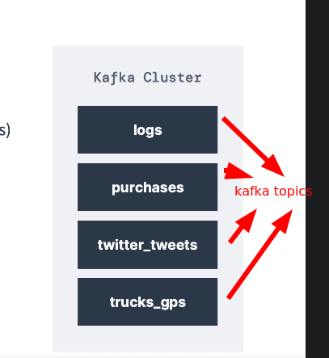
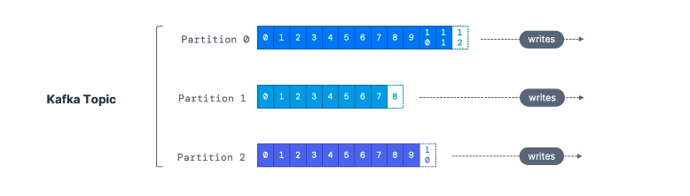

**[KAFKA THEORY]**

--------------------------------------------------------------------------------------//

# KAFKA TOPICS

* "Kafka topic" consiste em um node de stream de dados especificos, que esta contido em um **kafka cluster**

* Um paralelo pode ser feito entre um topico kafka e uma tabela no db, mas de modo que os topicos nao possuem constraints, ou seja, não ha tratamento para os dados incluídos no mesmo dentro da engine do kafka.

**Feito o paralelo entre o topico e uma tabela no db, deve ficar claro que esse tipo de componente nao permite qualquer tipo de query, o unico jeito de interagir com os dados de um topico sao via "kafka producers" (enviando dados para o topico) e "kafka consumers" (leem dados de determinado topico).**

* Nao existe limitação para quantidade de topicos em um cluster. 

* Topicos sao identificaveis pelo seu nome.

* Qualquer formato de arquivo pode ser incluído em um topico.

* Uma sequencia de mensagens em um tópico é denominado "data stream".

========================================================================

## TOPICS PARTITIONS & OFFSETS

* Topicos podem ser dividos em partições.

 - cada partição armazena um "data stream".
 - O "data stream" que reside em cada partição é ordenada.
 - Cada mensagem que reside no "data stream" de determinada partição recebe um id incremental, que é chamado de **OFFSET**.
 
 * **Offsets** so possuem real significado dentro da partição especifica a qual foram alocados.
 (offsets se repetem em cada partição, pois sao numeros alto-incrementaveis)

 * **Offsets** nao sao reutilizaveis, mesmo que mensagens anteriores tenham sido deletadas/consumidas.
 
 * Kafka Tópics sao **imutaveis**, uma vez que o dado é escrito em uma partição, os mesmos não podem ser deletados ou alterados. 
 
 

**Dados em topicos kafka sao armazenados por um periodo limitado de tempo (default - 1 semana, porém essa validação é configurável)**

* A ordem das mensagens em um "data stream" contido em uma partição de um topico é garantida apenas no contexto da partição, ou seja as unicas mensagens que estarao na mesma ordem de inclusao, sao aquelas sob a mesma partição.

* Dados sao vinculados a uma partição especifica de maneira randomica, a nao ser que uma chave seja vinculada a mensagem.

* A quantidade de partições dentro de um tópico nao possui limite definido.
