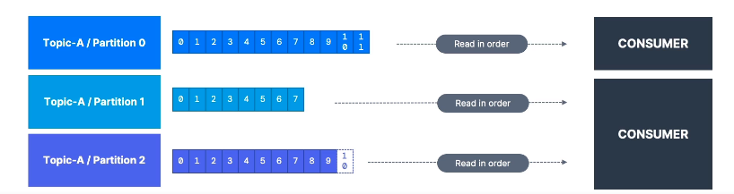
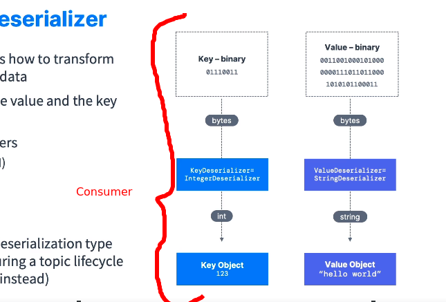

**[KAFKA THEORY]**

--------------------------------------------------------------------------------------//

# KAFKA CONSUMERS

* Consumers que tem a obrigatoriedade de ler os dados disponibilizados nos tópicos (pull-model).

* Consumers devem saber de quais brokers irão ler.

* Caso houver algum problema no lado do servidor (brokers), o consumer vai saber tratar o ocorrido e 
  continuar o funcionamento normalmente.

* Os dados (data-streams) contidos nas partições dos tópicos serão lidos em sua respectiva ordem (dentro do contexto da partĩção).
 - low to high **OFFSET** (0,1,2,3 ..)
 

========================================================================

## KAFKA DESERIALIZAR

**O contrario da serialização, deserializar significa tranformar "byte-streams" em objetos/dados**

* O consumer precisa saber em avanço o formato da chave e do conteúdo (valor) que o mesmo deverá deserializar.

* Os tipos de serialização (producers) && deserialização (consumers) nao devem ser alterados durante o ciclo de vida 
  do tópico.

- Obs: **Nao altere o tipo de dados que o producer envia para determinado topico, pois dessa forma voce tambem devera alterar todos os consumers que estao inscritos no topico em questao, caso contrario voce ira quebrar a logica de processamento dos consumers, pois eles vao estar esperando um tipo de dados e nao saberao tratar tipos nao mapeados**.

**Caso seja do interesse alterar o tipo de dados de determinado tópico, crie um novo tópico e alimente o mesmo com o tipo de dados esperados pelos consumers atualizados (de qualquer maneira os consumers deverao ser modificados, o que muda é a quantidade de esforço).
--------------------------------------------------------------------------------------//