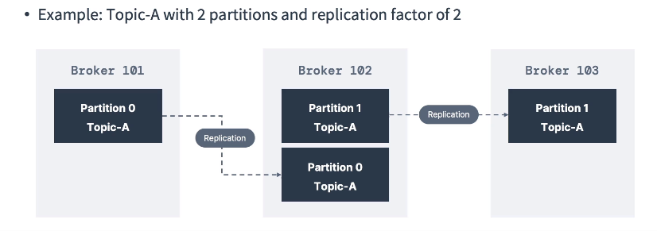
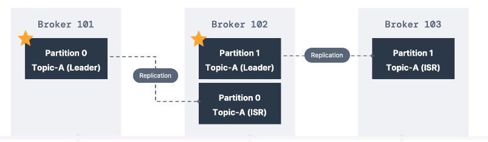

**[KAFKA THEORY]**

--------------------------------------------------------------------------------------//

# KAFKA TOPIC REPLICATION FACTOR

* Fator de replicação nada mais é que a quantidade de brokers reserva irao existir para cada broker em produção.

* Em produção o fator de replicação de um broker sempre deve ser maior que 1.

  **Deste maneira caso um broker caia ou seja derrubado, haverá outro com uma exata copia dos dados, pronto para servir os clients em seu lugar**.

* Um fator de replicação N para determinado topico, significa que cada partição existira em N brokers.  

  
========================================================================

## CONCEPT OF LEADER FOR PARTITION

* Apenas um broker pode ser o lider de determinada partição.

* Caso o broker lider de determinada partição caia ou seja derrubado, o broker que contém a replica
  dessa partição específica e nao é lider de nenhuma outra partição passará a ser o lider da mesma.

* Clients (consumers e producers) so podem incluir e consumir dados de brokers que sejam lideres das partições que estao sendo manipuladas.

* Dito isto, toda partição deve ter um broker lider e multiplas replicas espalhadas por outros brokers.

  **CASO A REPLICAÇÃO DOS DADOS OCORRA NO TEMPO MEDIO IDEAL, AS REPLICAS PODEM SER CHAMADAS DE "ISR" (IN-SYNC REPLICA)**

* Os clients (producers e consumers) sabem qual é o broker lider de determinada partição, para que os mesmos possam sempre se comunicar diretamente com eles.
--------------------------------------------------------------------------------------//