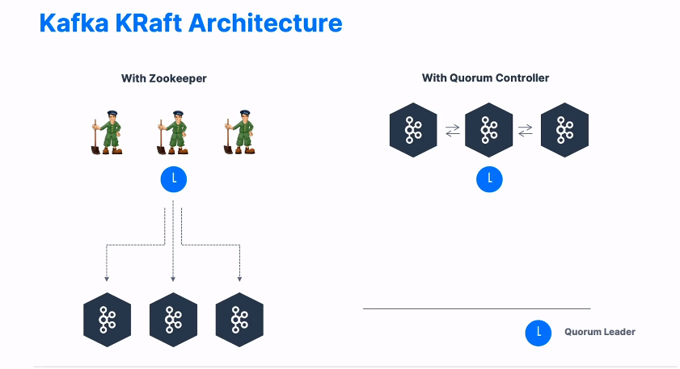
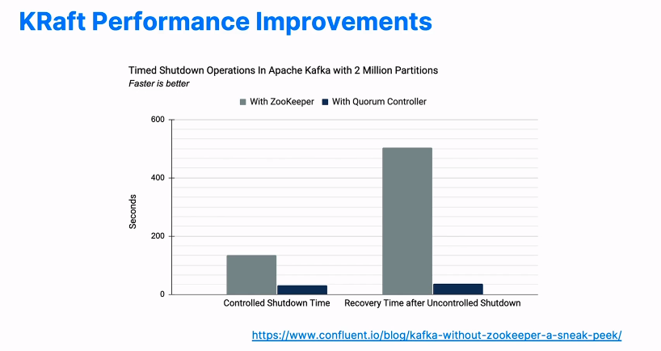

**[KAFKA THEORY]**

--------------------------------------------------------------------------------------//

# KAFKA KRAFT

**Nas versoes 3.x kafka vem removendo a dependencia do zookeeper e substituindo o executor de suas funcoes pelo kraft**

* A remoção do zookeeper trouxe:
  - maior escalabilidade.
  - maio estabilidade no servico.
  - unico modelo de seguranca para o sistema inteiro.
  - melhor e maior responsividade em situações de shutdown de recovery time.
  

* kafka 3.3.1 ja implementa o protocolo raft e é estavel o suficiente para ser aplicado em ambientes produtivos.  

* arquitetura simplificada sem o advento do zookeeper.

--------------------------------------------------------------------------------------//