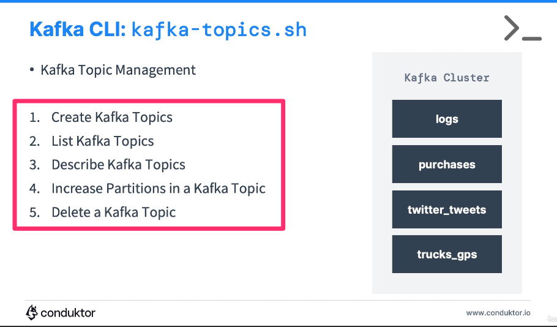

**[KAFKA CLI TOPICS COMMANDS]**

--------------------------------------------------------------------------------------//

# CREATE AN TOPIC

## COMMAND
- kafka-topics.sh --command-config playground.config --bootstrap-server cluster.playground.cdkt.io:9092 --create --topic first_topic --partitions 5 --replication-factor 2

## COMMAND BREAKDOWN
(--command-config playground.config) -> passes on aditional connection configs to the command.
* Obs: This one is necessary to connect to a secure kafka cluster

(--bootstrap-server cluster.playground.cdkt.io:9092) -> passes on the bootstrap server to the command.
(--create) -> command to create a topic.
(--topic my_topic ) -> passes on the name of the topic to be created.
(--partitions 5) -> passes on the number of partitions to be created in the topic.

--------------------------------------------------------------------------------------//

# REPLICATION FACTOR
(--replication-factor 2) -> passes on the replication factor to the command.

* replication factor stands for a way to replicate a topic data across brokers in a kafka cluster for disaster recovery purposes.
- Obs: you cannot have a replication factor higher than the number of brokers you have in your cluster, otherwise across wich brokers would you replicate the topic data?

--------------------------------------------------------------------------------------//

# LIST TOPICS
## COMMAND
kafka-topics.sh --command-config playground.config --bootstrap-server cluster.playground.cdkt.io:9092 --list

(--list) -> command to list all topics in the cluster.

--------------------------------------------------------------------------------------//

# DESCRIBE TOPICS
## COMMAND
kafka-topics.sh --command-config playground.config --bootstrap-server cluster.playground.cdkt.io:9092 --topic first_topic --describe

(--topic first_topic --describe) -> define the topic you want to describe first, then describe it.

* Obs: 'Isr' stands for 'In Sync Replica'.
--------------------------------------------------------------------------------------//

# DELETE TOPICS
## COMMAND
kafka-topics.sh --command-config playground.config --bootstrap-server cluster.playground.cdkt.io:9092 --topic second_topic --delete

(--topic second_topic --delete) -> define the topic you want to delete first, then delete it.