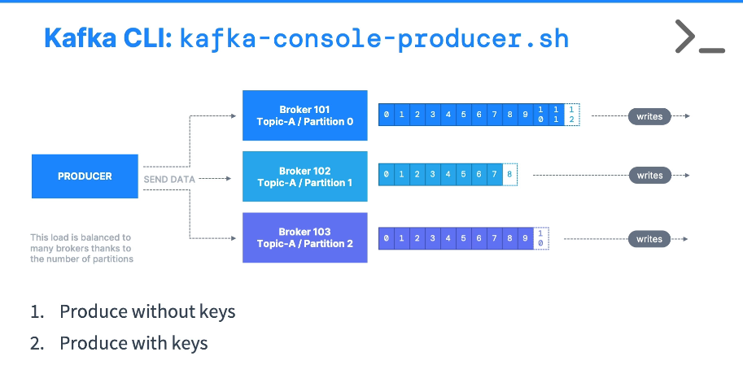

**[KAFKA CLI CONSOLE PRODUCER]**

--------------------------------------------------------------------------------------//

# PRODUCING TO AN TOPIC

## COMMAND
- kafka-console-producer.sh --producer.config playground.config --bootstrap-server cluster.playground.cdkt.io:9092 --topic testing_1_partition_topic

>Hello World
>My name is Conduktor
>I love Kafka
>^C  (<- Ctrl + C is used to exit the producer)

## COMMAND BREAKDOWN
(>Hello World) -> everything in the same line as the '>' will be considered part of the message.
* Obs: This one is necessary to connect to a secure kafka cluster

--------------------------------------------------------------------------------------//

# PRODUCING MESSAGES WITH PROPERTIES

## COMMAND
- kafka-console-producer.sh --producer.config playground.config --bootstrap-server cluster.playground.cdkt.io:9092 --topic testing_1_partition_topic --producer-property acks=all

## COMMAND BREAKDOWN
(--producer-property acks=all) -> passes on aditional producer properties to the command.
* Obs: In this specific case acks all demands that all the brokers linked to this topic (lider and replicas) confirm that the message was received

--------------------------------------------------------------------------------------//

# PRODUCING MESSAGES WITH KEY

## COMMAND
- kafka-console-producer.sh --producer.config playground.config --bootstrap-server cluster.playground.cdkt.io:9092 --topic testing_1_partition_topic --property parse.key=true --property key.separator=:
>example key:example value
>name:Stephane

## COMMAND BREAKDOWN
(--property parse.key=true)-> defines that the messages ahead are demanded to have an key
(--property key.separator=:)-> each of the following messages has to be composed of key:value separated accordingly with the defined separator, in this case beign ':'.

* Obs: By producing messages with the same key, you are enssuring that they are going to the same partition on the specified topic