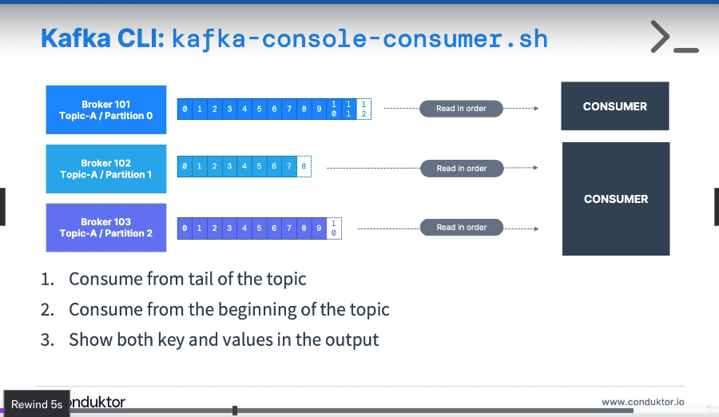
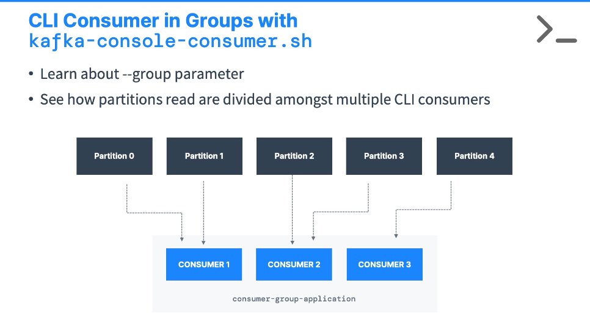

**[KAFKA CLI CONSOLE PRODUCER]**

--------------------------------------------------------------------------------------//

# CONSUMING FROM AN TOPIC

## COMMAND
- kafka-console-consumer.sh --consumer.config playground.config --bootstrap-server cluster.playground.cdkt.io:9092 --topic testing_1_partition_topic

## COMMAND BREAKDOWN
* Obs: This command sets an active listener to the specified topic and will start consuming messages from now on, past messages won't be consumed

--------------------------------------------------------------------------------------//

# CONSUMING FROM AN TOPIC STARTING AT THE BEGINNING

## COMMAND
- kafka-console-consumer.sh --consumer.config playground.config --bootstrap-server cluster.playground.cdkt.io:9092 --topic testing_1_partition_topic --from-beginning

## COMMAND BREAKDOWN
(--from-beginning) -> Demands that messages in the specified topic are consumed from the beginning

--------------------------------------------------------------------------------------//

# CONSUMING FROM AN TOPIC AND DISPLAYING KEYS, TIMESTAMP, PARTITION NUMBER AND VALUE

## COMMAND
- kafka-console-consumer.sh --consumer.config playground.config --bootstrap-server cluster.playground.cdkt.io:9092 --topic second_topic --formatter kafka.tools.DefaultMessageFormatter --property print.timestamp=true --property print.key=true --property print.value=true --property print.partition=true --from-beginning

## COMMAND BREAKDOWN
(--formatter kafka.tools.DefaultMessageFormatter --property print.timestamp=true --property print.key=true --property print.value=true --property print.partition=true) -> Sets custom formatter to the consumer messages displayed in console as they are consumed

--------------------------------------------------------------------------------------//

# CONSUMING FROM MULTIPLE PARTITIONS USING CONSUMER-GROUPS

## COMMAND
- kafka-console-consumer.sh --consumer.config playground.config --bootstrap-server cluster.playground.cdkt.io:9092 --topic third_topic --group my-first-application

## COMMAND BREAKDOWN
(--group my-first-application) -> Defines the following consumer as part of the consumer-group 'my-first-application'

* Obs: Defining multiple consumers as part of the same group, creates a load-balancing effect, where each consumer will consume from a different partition of the topic.

* Obs.2: if there are more consumers than partitions, some consumers will remain inactive.

* Obs.3: if messages are consumed from a specific consumer that is part of a group that means 
   the partitions are now bonded with the group, so if all the consumers from this group die,
   the next time any consumer of this specific group comes back, all the messages are going to
   be routed to it from where it stopped.

* Obs.4: if you target the same topic but set a different group and apply the 'from_beginning' flag, 
   the consumer will consume all the messages from the beginning of the topic, regardless of 
   other consumers that are part of other groups that also target the same topic. 

