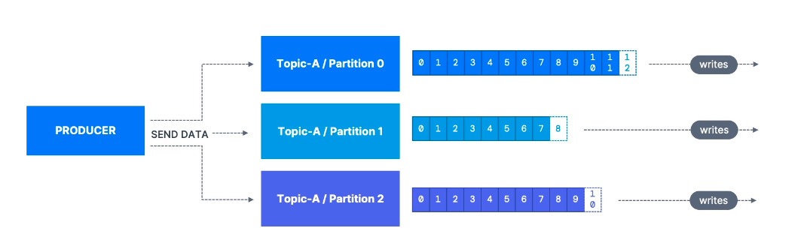
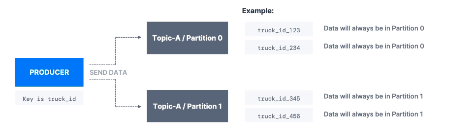
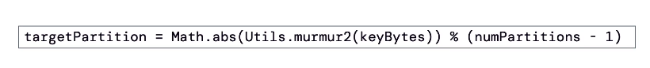
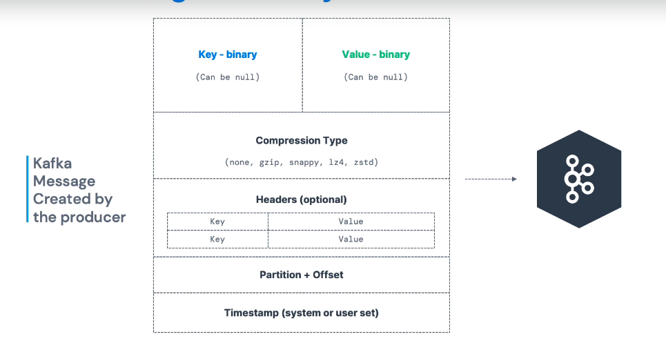
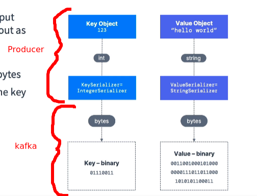

**[KAFKA THEORY]**

--------------------------------------------------------------------------------------//

# KAFKA PRODUCERS

* Incluem dados nos topicos.

* Producers ja sabem para qual partição irao escrever e sabem para qual broker endereçar, a 
  engine do kafka nao trata isso.

* em caso de falha no broker, producers conseguem se recuperar automaticamente.

* cada partição de um topico ira receber mensagens de um ou mais producers.

* Kafka é denominado escalavel pois o mesmo aplica loadBalancing dadas as mensagens recebidas, 
  entre as inumeras partições dentro de um topico.
 
  neste caso, caso um dataStream tenha alcançado um determinado limite de indexes, ele remaneja os dados que estao chegando para outras partições com menos volume.

  este mecanismo é indispensavel para evitar gargalos no processamento .

========================================================================

# KAFKA MESSAGE-KEYS

* Producers podem escolher (opcional) enviar os dados pelo kafka com uma chave (string, number, binary ..)

* caso o valor da chave seja nulo, os dados sao enviados pela engine do kafka em um processo denominado **Round Robin** 
  e.g (**partition 0, partition 1, partition 2 ...)** -> loadbalancing.

 Mas caso o producer envie a mensagem com a chave preenchida, as mesmas vao para a mesma partição -> hashing.

* Neste caso quando especificamos uma chave, temos a intenção de ordenar as mensagens dada uma regra customizada. 

* Neste caso a regra customizada é: As chaves com sufixo "id_123" e "id_234" serao processadas na respectiva ordem e 
  seguindo o racioncinio, o mesmo se aplica para prefixos "id_345" e "id_456".

========================================================================

# KAFKA PARTITIONER && KAFKA MESSAGE-KEY HASHING

* Kafka partitioner é um componente de lógica em código do kafka que determina para qual 
  partição o registro (record) vai ser alocado.

* **Key hashing** é o processo dentro do código e contido no kafka partitioner, que determina 
  qual chave vai para qual partição.

* Por padrão o **kafka partitioner** aplica hashing nas chaves da mensagem usando o 
  algorítimo murmur2.
 

========================================================================

# KAFKA MESSAGES ANATOMY

**Key**:
- Pode ser nulo.
- armazenado em valor binario.

**Valor**:
- Pode ser nulo.
- armazenado em valor binario.

**Compression Type**:
- none, gzip, zip ...

**Headers**:
- Opcional
- chave|valor

**Partition + Offset**

**TimeStamp**
- default ou customizado. 

========================================================================

# KAFKA MESSAGE SERIALIZER

**Serialização em java é o conceito de representar um objeto no estado de "byte stream".**

**A stream serealizada pode ser encriptada, autenticada e comprimida, tudo isso de acordo com os protocolos ja definidos para computação java.**

* A engine do kafka só aceita **bytes streams** de input pelos producers, e só envia **bytes streams** como output para consumers.
    
  Logo, consumers devem deserealizar as mensagens recebidas da engine.  

