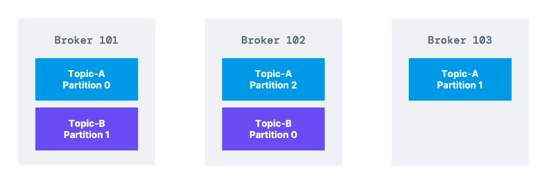
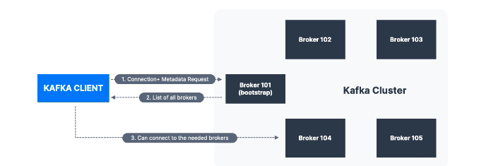

**[KAFKA THEORY]**

--------------------------------------------------------------------------------------//

# KAFKA BROKERS

* Um **KAFKA-CLUSTER** é um agregado de varios **KAFKA-BROKERS (SERVERS)**.

* Todos os brokers sao identificaveis por **ID (integer)**.

* dentro do kafka-cluster cada broker é responsavel por possuir partições distintas de tópicos, ou seja, até 
  no contexto de brokers e clusters existe a distribuição de armazenamento de partições, isso tudo para deixar mais viavel ainda a escalabilidade da aplicação (kafka).   

========================================================================

## KAFKA BROKER DISCOVERY

* Todo kafka-broker tambem pode ser chamao de "bootstrap-server" (referencia a como este tipo de componente é denominado na sdk).

* Depois de ja estar conectado a qualquer broker, voce sendo consumer (client) ou producer (client), voce ja tera acesso ao cluster inteiro (os proprios clients do kafka sabem como se conectar desta maneira automaticamente).

* A principio uma vez que o client (consumer ou producer) estiver conectado ao broker (server) ele recebe uma lista de todos os brokers conectados ao kluster.
--------------------------------------------------------------------------------------//