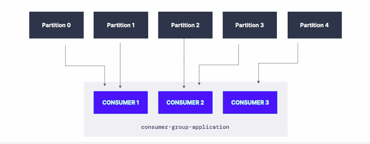
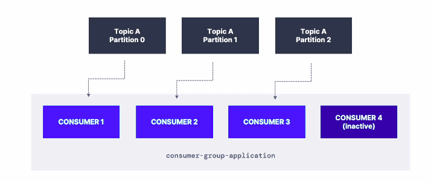

**[KAFKA THEORY]**

--------------------------------------------------------------------------------------//

# KAFKA CONSUMER-GROUPS

* Todos os consumers em kafka, leem dados por meio de consumer-groups.

* Cada consumer dentro de um consumer-group lee de uma partições diferentes do topico em questao, de forma que um consumer pode ler de N partições, mas dois consumers no mesmo contexto nao podem ler da mesma partição.

* Se houverem mais consumers em um consumer-group que a quantidade de partições distintas em um topico, entao alguns consumers permanecerão inativos.

* É normal ter multiplos consumer-groups apontando para o mesmo topico e processando as mensagens para destinos diferentes, de modo que cada group tem seu offset unico.

* Consumer groups sao diferenciados pela propriedade "group.id" de forma que cada consumer devera apontar para seu respectivo group.

========================================================================

## KAFKA CONSUMER-GROUPS OFFSETS

* Kafka armazena o offset que determinado consumer esta lendo, desse modo mesmo que haja alguma erro do lado do consumer ou do servidor, quando o consumer voltar a dar pull no topico, o mesmo sabera em qual mensagem parou da ultima vez.

* Os offsets sao mantido em um kafka-topic de nome "__consumer_offsets__".

========================================================================

## SEMANTICAS DE ENTREGA DE MENSAGENS PARA CONSUMERS (COMO KAFKA MARCA AS MENSAGENS COMO PROCESSADAS).

* Por padrao consumers irao commitar os offsets apenas depois do processamento (entrega com sucesso) da mensagem ao consumer em questao. **AT LEAST ONCE (MODE)**

 **Esse approach pode causar o processamento de mensagens de forma duplicada, com isso CERTIFIQUE-SE que o processamento do app que esta consumindo pode ser indepontente (i.e processar registros duplicados nao causa impacto no processo)**.

* Outro aproach denominado **AT MOST ONCE (MODE)** implica em commitar o offset de leitura de um consumer, no exato momento em que a mensagem é recebida, e a antes do processamento.

 **Downside, se o processamento der errado, a mensagem será perdida**.
--------------------------------------------------------------------------------------//